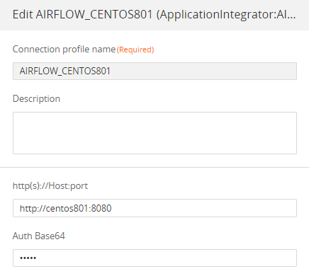
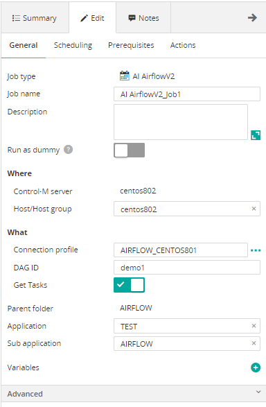
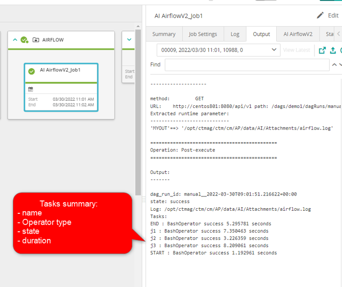

# Control-M Airflow v2
## Changes on this version

| Date | Who | What |
| - | - | - |
| 2022-07-18 | Mathieu Petit | First release |

## Contributions

| Date | Who | What |
| - | - | - |

## Short description:
Control-M Integration plugin for Apacge Airflow v2

## Prerequisites

- Control-M Version 9.20.000,
- Control-M Application pack 9.20

## Installation

- Deploy the integration AI AirflowV2.ctmai using Application Integrator.
 
## Detailed description:

### The job proceeds with these steps:
- Trigger a DAG
- Monitor for completion
- Display detailed output with tasks statuses and run time.
 
 ### Parameters
 ###### In Connection Profile
- Airflow URL.
- Basic authentication in Base64 format.
 
 ###### In Job definition
- DAG name
- Optional: get tasks details

## Control-M

* #### 1. Connection Profile 

* #### 2. Define a job

* #### 3. Output

