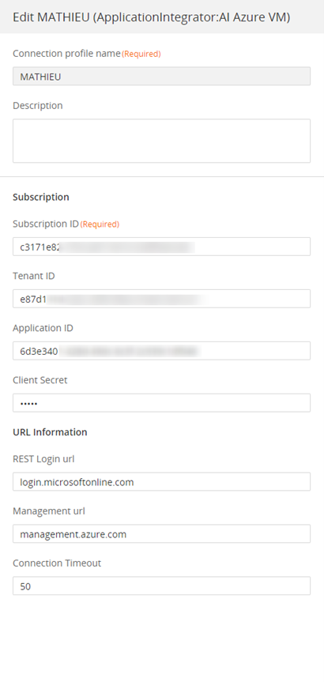
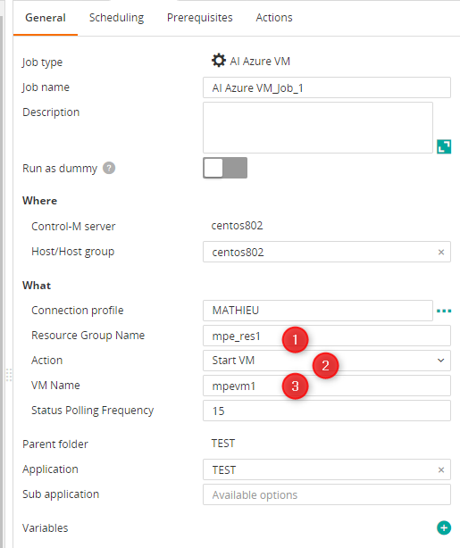
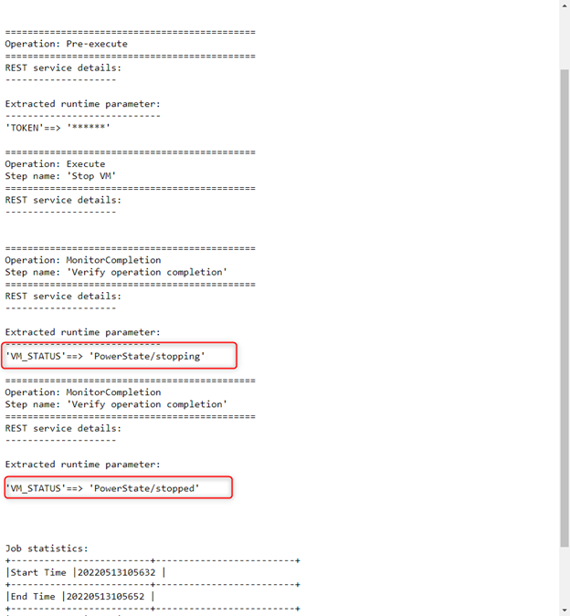

# Control-M Azure Stop/Start VM
## Changes on this version

| Date | Who | What |
| - | - | - |
| 2022-07-18 | Mathieu Petit | First release |

## Contributions

| Date | Who | What |
| - | - | - |

## Short description:
Control-M Integration plugin for Azure Stop/Start VM

## Prerequisites

- Control-M Version 9.20.000,
- Control-M Application pack 9.20

## Installation

- Deploy the integration AI Azure VM.ctmai using Application Integrator.
 
## Detailed description:

### The job proceeds with these steps:
- Start a VM
or
- Stop a VM
- Monitor the completion of the task
- Display the output
 
 ### Parameters
 ###### In Connection Profile
 - Subscription ID
 - Tenant ID
 - Application ID
 - Client Secret
 - REST Login URL: **login.microsoftonline.com**
 - Management URL: **management.azure.com**
 
 ###### In Job definition
 - Azure resource group name
 - VM name
 

## Control-M

* #### 1. Connection Profile 

* #### 2. Define a job

* #### 3. Output

