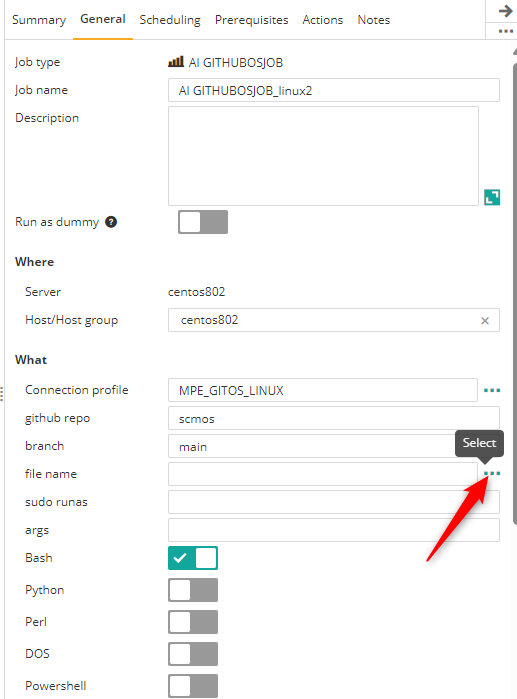
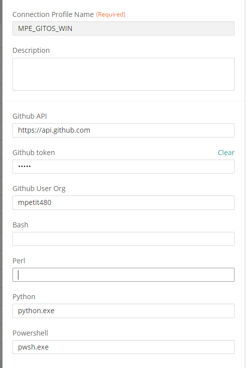
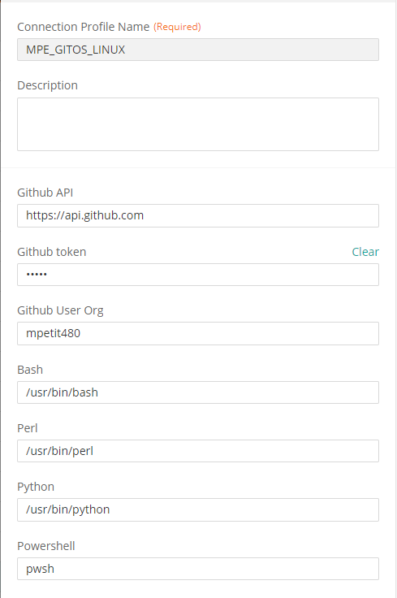
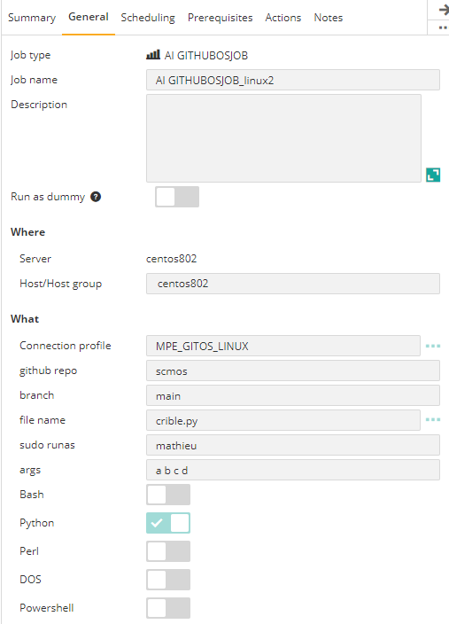
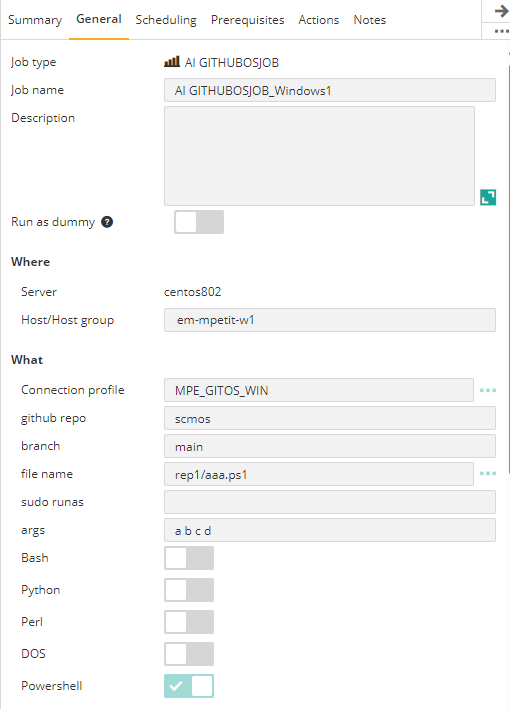

## Control-M Kubernetes pod exec/copy plugin
## Changes on this version

| Date | Who | What |
| - | - | - |
| 2024-07-23 | Mathieu Petit | First release |

## Contributions

| Date | Who | What |
| - | - | - |

## Short description:
Control-M Integration plugin to:
- Run a script from a Github repo and branch

It supports:
- Unix shell, Linux bash
- Windows DOS
- Powershell Linux and Windows
- Python
- Perl

## Prerequisites
- Control-M Version 9.0.21.000
- A Github token for Github API authentication

## Installation

- Deploy the integration GITHUBOS.ctmai using Application Integrator.
 
## Detailed description:

The job has these functionnalities
- It can display all files from a branch in order to select a script.
- It downloads in background the script from Github Organization, repo, branch to a temporary file in AI Attachement folder.
- Run the script
- On Unix/Linux, sudo is possible in job definition if the agent mode is sudo.
- Delete the temporary file
- Display logs in the ouput of Control-M job
 
 |       List branch     | 
|:----------------------:|
|  |

## Control-M

#### 1. Connection Profile 

Path of interpreters

|       Windows          | Linux                  | 
|:----------------------:|:----------------------:|
|   |   |

#### 2. Define a job
In the Deployment tags field, specify the metadata tags.
Type of Actions

|       Python Linux      | Powershell Windows    | 
|:----------------------:|:----------------------:|
|  |  | 
