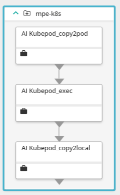
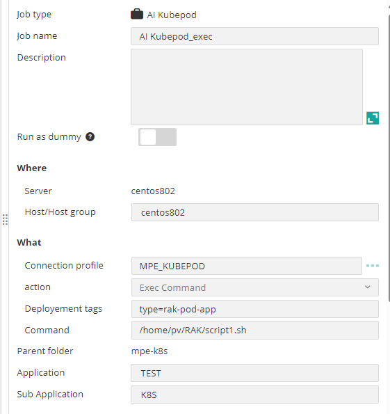
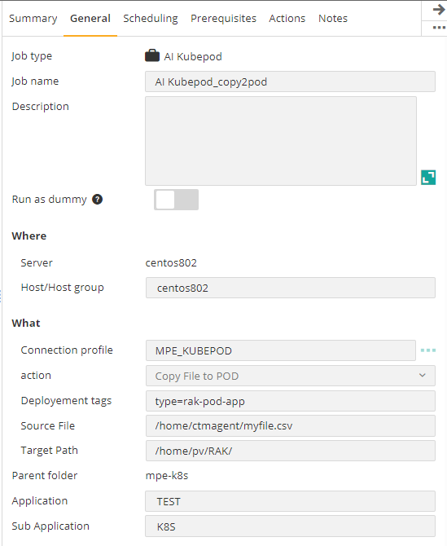

## Control-M Kubernetes pod exec/copy plugin
## Changes on this version

| Date | Who | What |
| - | - | - |
| 2024-07-23 | Mathieu Petit | First release |

## Contributions

| Date | Who | What |
| - | - | - |

## Short description:
Control-M Integration plugin to:
- Run command in a pod
- Copy file from Local to pod
- Copy file from pod to local

Example of Workflow

## Prerequisites
- Control-M Version 9.0.21.000,
- A Control-M Agent 9.0.21 with kubectl configured with K8S context.

## Installation

- Deploy the integration AI Kubepod.ctmai using Application Integrator.
 
## Detailed description:

The job has these functionnalities
- It identifies the pod coreesponding to metadata of the statefulset/deployment
- Run command in a pod
- Copy file from Local to pod
- Copy file from pod to local
- Display logs in the ouput of Control-M job
 

## Control-M

#### 1. Connection Profile 

RunAs and kubectl path

#### 2. Define a job
In the Deployment tags field, specify the metadata tags.
Type of Actions

|       Exec in pod      | Copy from local to pod | Copy from pod to local |
|:----------------------:|:----------------------:|:-----------------------|
|  |  |  |
