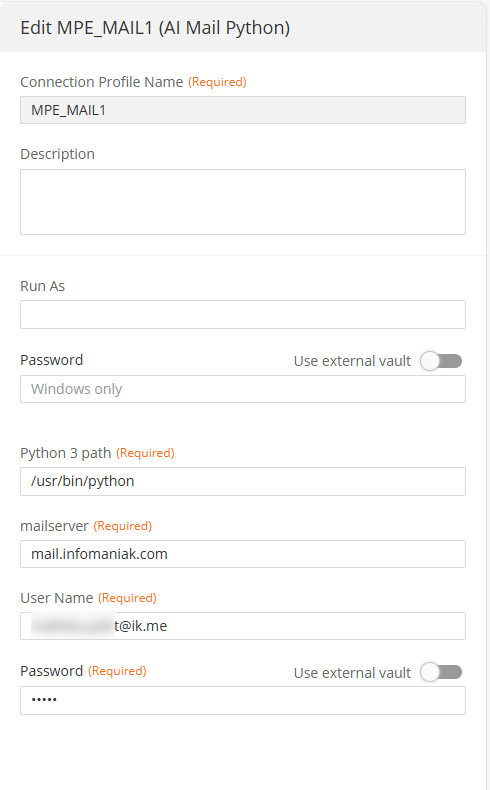
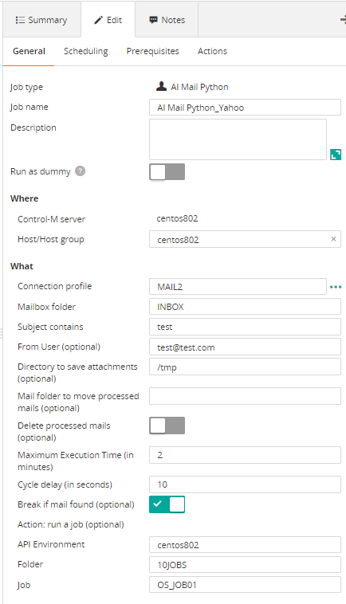
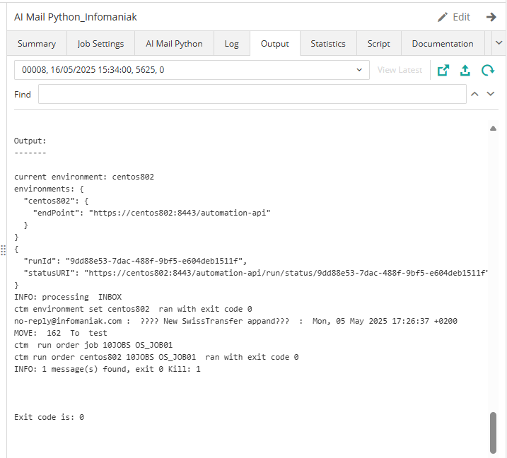

# Control-M Python Mail plugin
Version 1.0

### Short description:
Control-M Integration plugin for MAPI mailbox

#### Pre requisites

Control-M Version 9.20.000,
Control-M Application pack 9.20
Python 3

### Installation

- Deploy the integration using Application Integrator and copy the Python script at Agent side.
- Install imap_tools library: pip install imap_tools
- Copy the script imap_d.py on the agent.

 
### Detailed description:

The script detects mail arrivals in a mailbox depending on criteria.
2 options:
-	Without loop, on Ended OK, it will start another job following conditions
-	With a loop and a job to trigger, it will wait and start itself a job.
 

### Control-M

* #### 1. Connection Profile 

* #### 2. Define a job

* #### 3. Output

