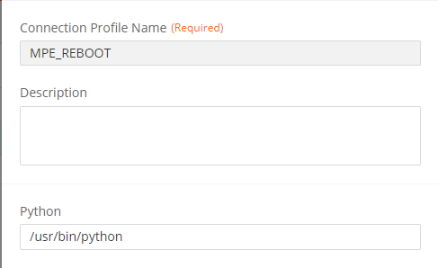
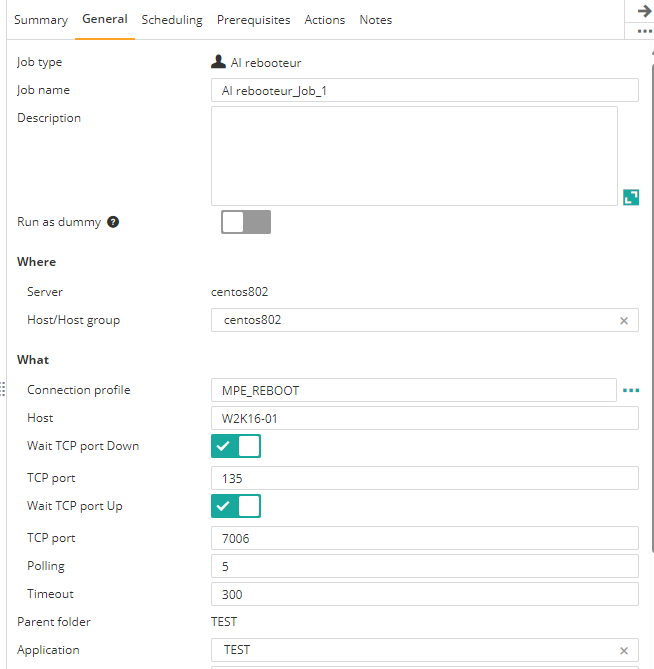

# Control-M Reboot plugin
## Changes on this version

| Date | Who | What |
| - | - | - |
| 2024-07-23 | Mathieu Petit | First release |

## Contributions

| Date | Who | What |
| - | - | - |

## Short description:
Control-M Integration plugin to handle reboot.
It will wait for the rebooted machine to be realyy down and/or up before being Ended OK.
Thus it prevents other job to be start while the shutdown is in progress.

## Prerequisites

- Control-M Version 9.0.21.000,
- A Control-M Agent 9.0.21 with Python 3

## Installation

- Deploy the integration AI Rebooteur.ctmai using Application Integrator.
 
## Detailed description:

The job has these functionnalities
- Wait a TCP port to be down (example: 22 on Linux, 135 on Windows)
- Wait a TCP port to be up (example Agent port 7006)
- Both: wait down and up.
- Display the output.
 

## Control-M

#### 1. Connection Profile 

Python path.

#### 2. Define a job

Select options: 
- Machine boot to monitor
- TCP ports to listen.
- Wait "Down" Yes/No
- Wait "Up"   Yes/No
- Global timeout

