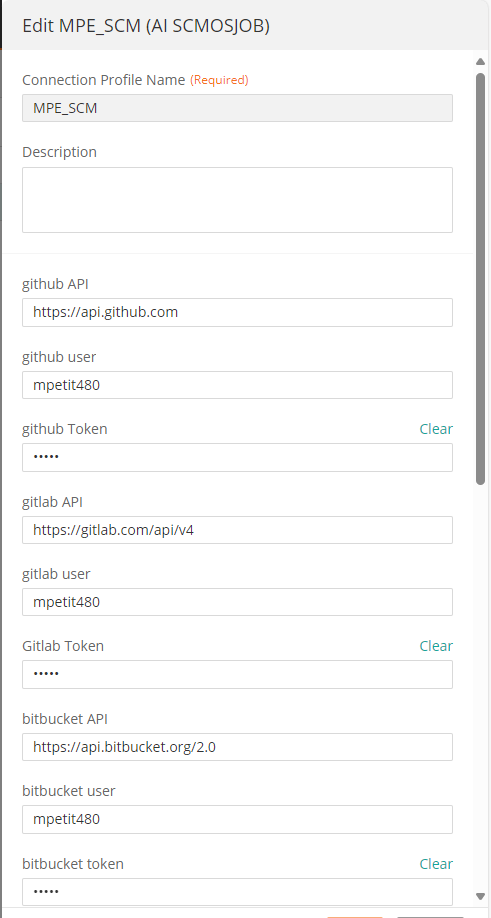
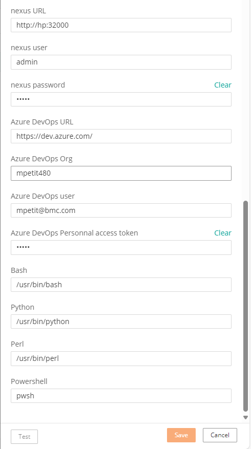
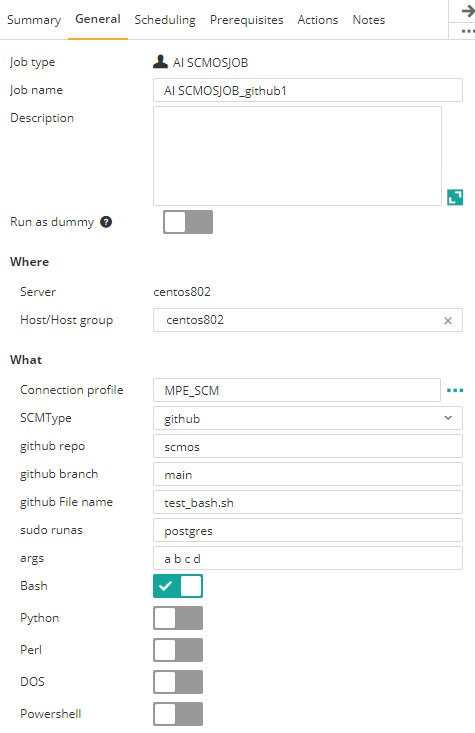
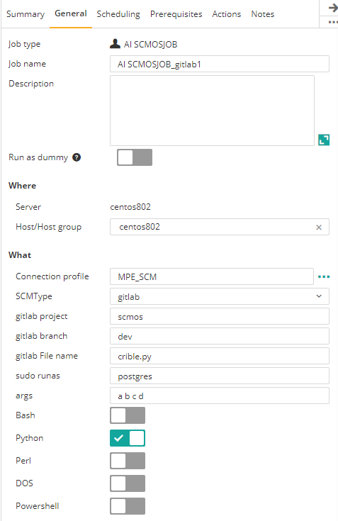
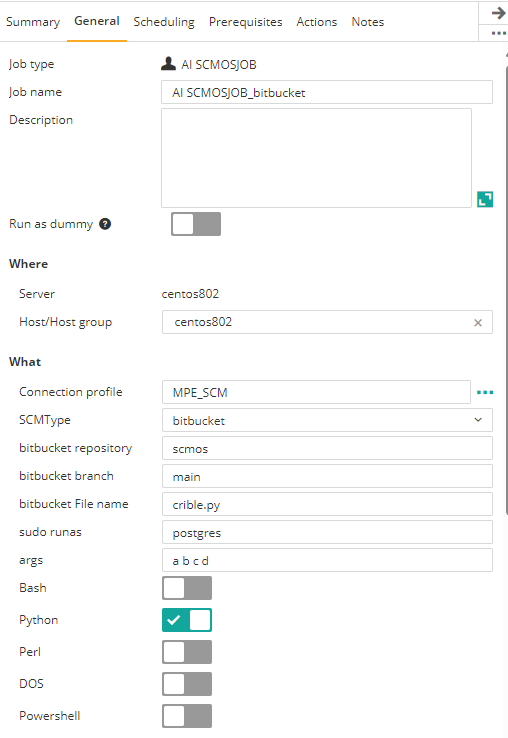
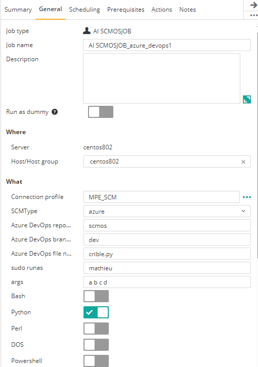

## Control-M Any http SCM job type
## Changes on this version

| Date | Who | What |
| - | - | - |
| 2024-07-23 | Mathieu Petit | First release |

## Contributions

| Date | Who | What |
| - | - | - |

## Short description:
Control-M Integration plugin to:
- Run a script from a http(s) Source code management 

It supports:
- Unix shell, Linux bash
- Windows DOS
- Powershell Linux and Windows
- Python
- Perl

and these SCM
- Github
- Gitlab
- Bitbucket
- Azure DevOps
- Nexus

## Prerequisites, depending on the SCM
- Control-M Version 9.0.21.000
- A Github token for Github API authentication
- A Gitlab token
- A bitbucket token
- An Azure DevOps User and token
- A Nexus user and password

## Installation

- Deploy the integration SCMOSJOB.ctmai using Application Integrator.
 
## Detailed description:

The job has these functionnalities
- It downloads in background the script from SCM Organization, repo, branch to a temporary file in AI Attachement folder.
- Run the script
- On Unix/Linux, sudo is possible in job definition if the agent mode is sudo.
- Delete the temporary file
- Display logs in the ouput of Control-M job
 

## Control-M

#### 1. Connection Profile 

Path of interpreters and SCM 

|            |                | 
|:----------------------:|:----------------------:|
|   |   |

#### 2. Define a job
In the Deployment tags field, specify the metadata tags.
Type of Actions

|       Github           | Gitlab                 | 
|:----------------------:|:----------------------:|
|  |  | 

|       Bitbucket           |       Azure DevOps  | 
|:----------------------:|:----------------------:|
|  |  |

|       Nexus         |       | 
|:----------------------:|:----------------------:|
|  |  |
